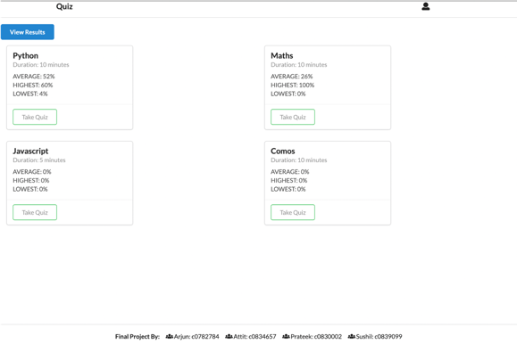

This project was developed as a Final Project Submission for PythonII at Lambton College.

### Quiz Management System
##### Functionality:
1. Store multiple quiz topics.
2. Show average, highest and lowest score for each quiz topic.
3. Randomly select 5 distinct questions, out of the question bank
4. Show a message on result screen and give user an option to re-take the quiz.
5. Store all quiz results.

##### Framework: Django
###### Templates using HTML, CSS and Semantic UI
###### Database: SQLite 3

##### How to run:
1. Download the git repository.
2. Use "python manage.py runserver", to run django's development server.

##### Screenshots:

